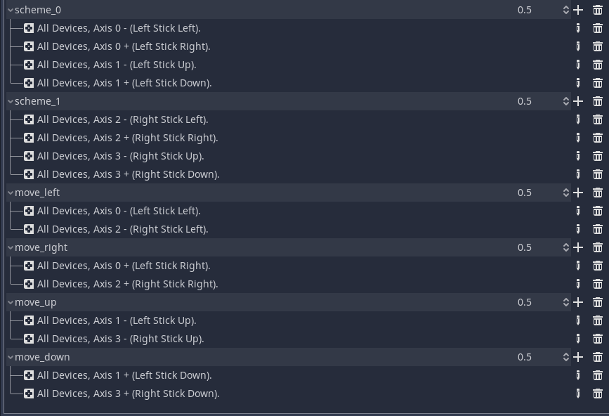

# InputFilter
The InputFilter makes it easy to distinguisch inputs from different controlers and even multiple control schemes on the same controler.

## Setup:
1. Get a InputFilter Resource (`InputFilter.from_string()` or `InputFilter.new()`)
2. Add these functions (or the content at the start if you already use them)
   ```py
    func _input(event):
        # The filter will only consider events that get parsed like this.
        # Not parsing events can be an easy way to lock all input temporarily.
        _input_filter.parse_input(event)

        # if you want to use events directly you can use this to filter manually
        if _input_filter.is_event_caught(event):
            pass

    func _process(_delta):
        # tells the filter when to update just_pressed and just_released.
        # this isn't needed if you don't use those.
        _input_filter.flush()
   ```
3.  Configure the Input actions.  
   Use general actions like "walk_left" and fill them with all buttons that should trigger the action.  
   Then put all buttons in a group (ex. WASD in "scheme_0" and the arrow buttons into "scheme_1"). They can be reused by using device filter you can reuse those groups for the controler schemes (ex. WASD & left joystick) but for clarity this shouldn't be done.
4. Make sure you use the correct InputFilters and have them configured with the right scheme group and device id (or "" and -1 to disable thse filter options).

# Example
The example will only work with correctly setup input actions.  
The Players will use move_left, move_right, move_up and move_down. The example supports 10 schemes named `scheme_0` to `scheme_9`.  
This is an example setup: 
It will spawn 1 player for each stick on each controler.

# InputFilter API

- `new(device := -1, group := "scheme_0")`:  
  use this to make new Filters that filter using the given device and scheme
- `flush()`:  
  updates buffers so just_pressed and just_released work
- `parse_input(event: InputEvent)`:  
   notify the filter about input events
- `is_event_caught(event: InputEvent)->bool`:
  manually check if event would be caught by the filter
## Input like functions
- `get_axis(negative_action: String, positive_action: String)->float`:  
  like [Input.get_axis()](https://docs.godotengine.org/en/stable/classes/class_input.html#class-input-method-get-axis)
- `get_axis(negative_x:StringName, positive_x:StringName, negative_y:StringName, positive_y:StringName)->Vector2`:  
  like [Input.get_axis()](https://docs.godotengine.org/en/stable/classes/class_input.html#class-input-method-get-vector) but without deadzone support.
- `is_action_just_released(action: String)->bool`:  
	like [Input.is_action_just_released()](https://docs.godotengine.org/en/stable/classes/class_input.html#class-input-method-is-action-just-released) but doesn't support exact.
- `is_action_just_pressed(action: String)->bool`:  
	like [Input.is_action_just_pressed()](https://docs.godotengine.org/en/stable/classes/class_input.html#class-input-method-is-action-just-pressed) but doesn't support exact.
- `is_action_pressed(action: String)->bool`:  
	like [Input.is_action_pressed()](https://docs.godotengine.org/en/stable/classes/class_input.html#class-input-method-is-action-pressed) but doesn't support exact.
## QOL functions
- `is_equal(to:InputFilter)->bool`:  
  test if 2 Input filters are the same.
- `_to_string()`:  
  turns the filter into a legible string. str() will use this function.  
  Usefull for saving.
- `static from_string(string:String)->InputFilter`:
  returns a new inputfilter from a string formated like results from _to_string().  
  Usefull for loading.
  Will crash if string is not the right format (`[InputFilter * devide_id=* input_group=*]`)
